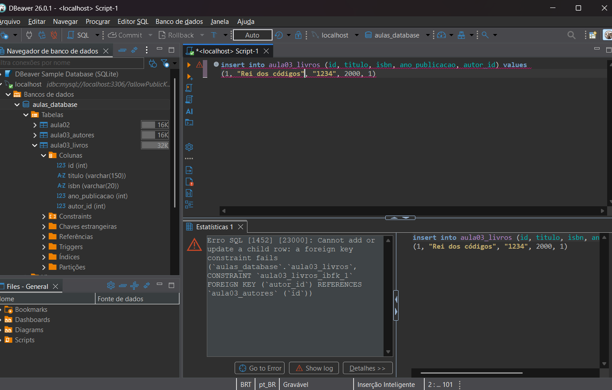
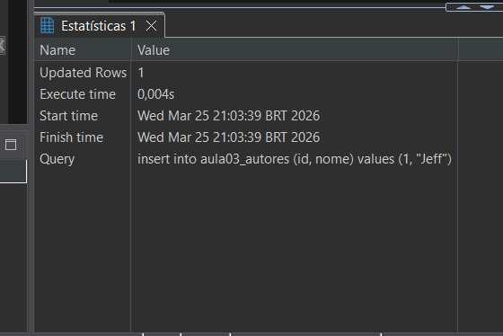
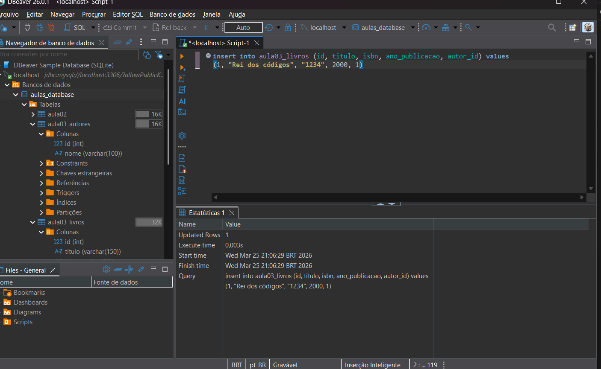
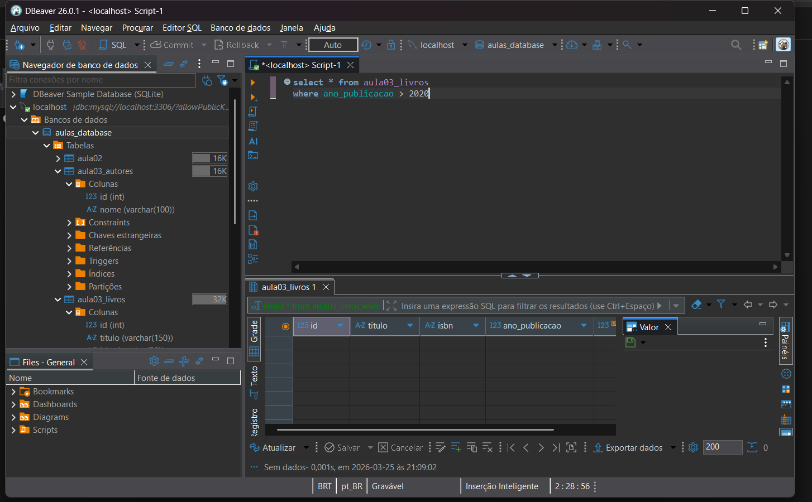
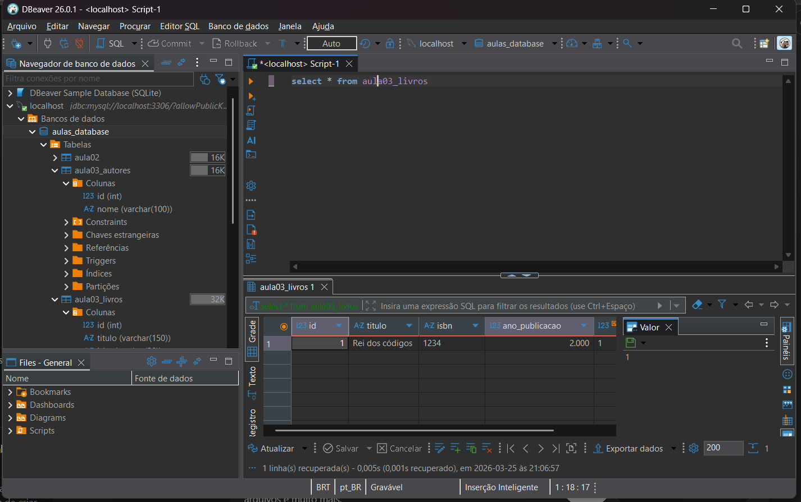

# A imagem abaixo mostra o erro ao tentar inserir um livro com autor inexistente:

Isso ocorre porque a chave estrangeira exige que o autor exista previamente na tabela Autores.

# Imagens dos comandos dando certo (pode estar faltando alguma parte XD)

